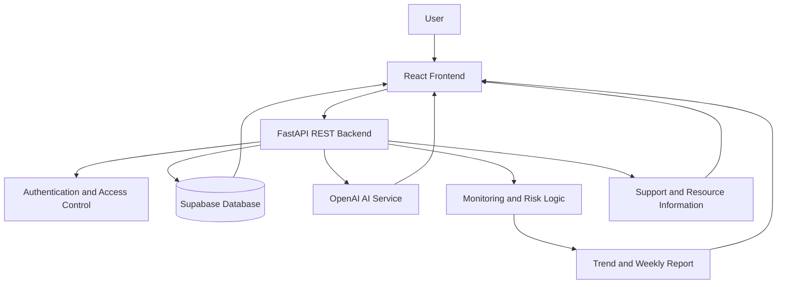
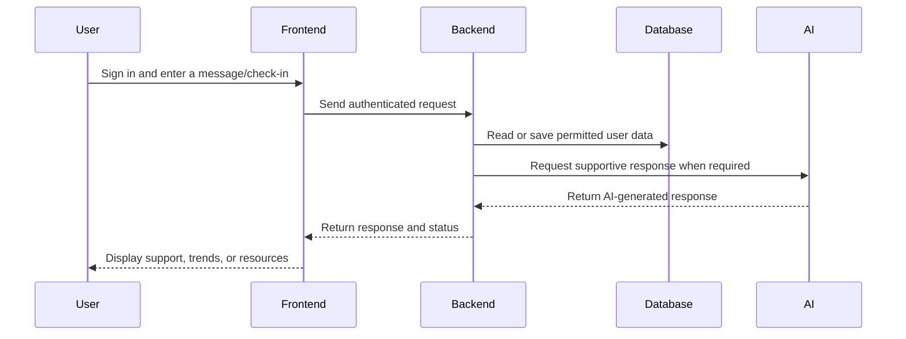

# 🧠 MANORAKSHA AI | Mental Health Support & Wellbeing

> **Smart India Hackathon 2026 — Software Solution**


## 📌 Project Information

| Item | Details |
|---|---|
| **Project name** | MANORAKSHA AI |
| **Problem Statement ID** | SIH26094 |
| **Problem Statement** | AI-powered dynamic mental health monitoring and distress prediction system for atrocities victims |
| **Theme** | MedTech / BioTech / HealthTech |
| **Category** | Software |
| **Team name** | Segmentation Error |
| **Live website** | [Open MANORAKSHA AI](https://mano-raksha-v9lt.vercel.app/) |
| **GitHub repository** | [View source code](https://github.com/GitAdmin921/MANO-RAKSHA) |

---

## 🎯 The Problem

People affected by atrocities and traumatic experiences may recognize emotional distress very late, hesitate to seek help, or remain unaware of available support resources.

Many existing support systems are event-driven: they respond when a person reaches a crisis point instead of helping users understand their emotional patterns over time. Cost, distance, stigma, and limited access to professional support can also make timely help difficult.

MANORAKSHA AI is designed to provide an accessible, private, and supportive digital space for early awareness and guided support.

## 💡 Our Solution

**MANORAKSHA AI** is a privacy-focused mental-health support web application combining self-reflection, emotional check-ins, journaling, supportive AI conversation, trend monitoring, and support resources.

> **Monitor continuously → Understand trends → Encourage earlier support → Keep humans in control**

### Core Features

- 🧠 **Supportive AI conversation** — A non-judgmental space to express thoughts and feelings.
- 📊 **Dynamic mental-health monitoring** — Observes changes relative to a user's own personal baseline.
- 📝 **Daily mood check-in** — Builds a personal emotional timeline.
- 📔 **Private journal** — Supports personal reflection and emotional expression.
- 📈 **Weekly trend report** — Helps users understand patterns over time.
- 🚨 **Distress-risk awareness** — Presents concerning changes as signals for additional attention; it is not a diagnosis.
- 👥 **Human-in-the-loop escalation** — Supports defined escalation pathways instead of autonomous clinical decisions.
- 📍 **Support and resource discovery** — Helps users locate professional, community, and emergency resources.
- 🌐 **Multilingual interface** — Current interface support for English and Hindi, with scope for more Indian languages.
- 📱💻 **Responsive design** — Designed for phones, laptops, and desktop screens.
- 🔐 **Privacy-first design** — Uses authentication, minimum necessary data, and scoped access.

## ⭐ Our Unique X-Factor

### 1. Personal baseline
The system focuses on changes in a user's own normal pattern rather than comparing the user with a universal emotional standard.

### 2. Explainable distress signals
The platform is designed to provide context for why a trend or signal changed instead of displaying an unexplained score.

### 3. Multimodal-ready support
The architecture can be extended to text, voice, video, and engagement signals for users who may find traditional interfaces difficult.

### 4. Human control and safety
MANORAKSHA AI is an early-support and awareness tool. It does not diagnose users and does not make autonomous clinical decisions.

## 🏗️ System Architecture



### Typical workflow



## 🛠️ Technology Stack

| Layer | Technology | Purpose |
|---|---|---|
| **Frontend** | React.js, JavaScript, Vite | Interactive and responsive user interface |
| **Styling** | CSS | Responsive layout, themes, accessibility, and visual design |
| **Backend** | Python, FastAPI, Uvicorn | REST APIs, server logic, chat handling, and monitoring-related operations |
| **Database** | Supabase | Secure data storage and backend services |
| **AI integration** | OpenAI API | Supportive conversational responses and AI-assisted functionality |
| **Hosting** | Vercel and Render | Frontend and backend deployment |
| **Version control** | GitHub | Source-code management and collaboration |

> The presentation template may mention Node.js/Express as an earlier technical plan. The current working prototype uses a FastAPI backend.

## 🎨 Design Principles

- **Private:** Sensitive information should be handled carefully.
- **Accessible:** Simple navigation and responsive layouts.
- **Culturally sensitive:** Localized interface options and respectful language.
- **Non-judgmental:** Encourages expression without stigma.
- **Explainable:** Gives meaningful context behind monitoring signals.
- **Human-centered:** Encourages professional or emergency help when needed.
- **Safety-first:** AI output does not replace clinical care.

## ⚖️ Feasibility and Viability

### Technical feasibility

- Uses established web technologies.
- Uses API-based AI integration and a managed database.
- Uses modular frontend and backend components.
- Can be deployed through common cloud hosting platforms.

### Economic feasibility

- No special hardware is required for the web prototype.
- Cloud services can scale with usage.
- Modular components reduce maintenance complexity.
- The initial prototype can be developed with limited infrastructure.

### Operational feasibility

- Simple onboarding and navigation.
- Browser-based access.
- Supportive AI and self-monitoring features can be accessed subject to service availability.
- Responsive experience across phone, laptop, and desktop.

### Scalability

- Modular architecture.
- Additional languages and monitoring signals can be added.
- Voice/video interaction can be integrated in future versions.
- Resource and escalation workflows can be expanded by region.

## 🛡️ Safety and Risk Mitigation

| Risk | Mitigation |
|---|---|
| **False alarm** | Treat risk as a signal, use thresholds, and include human review where applicable |
| **Missed crisis** | Provide safety guidance, emergency information, and escalation pathways |
| **Sensitive data exposure** | Use authentication, data minimization, secure configuration, and scoped access |
| **Language or population bias** | Evaluate across languages and user groups; monitor model behavior |
| **AI overreach** | Do not provide diagnosis or autonomous clinical decisions |
| **Incorrect AI response** | Encourage professional support and provide emergency guidance for urgent situations |

### Safety notice

MANORAKSHA AI is not a substitute for a mental-health professional or emergency service. In an immediate emergency, users should contact local emergency services or a qualified professional. In India, users may also explore **Tele-MANAS through 14416**, subject to current service availability.

## 🚀 Quick Setup

### 1. Clone the repository

```bash
git clone https://github.com/GitAdmin921/MANO-RAKSHA.git
cd MANO-RAKSHA
```

### 2. Install frontend dependencies

```bash
cd frontend
npm install
```

### 3. Run the frontend

```bash
npm run dev
```

### 4. Run the backend

Open another terminal:

```bash
cd backend
python -m venv .venv
```

Activate the environment:

**Windows:**

```bash
.venv\Scripts\activate
```

**macOS/Linux:**

```bash
source .venv/bin/activate
```

Install dependencies and run the API:

```bash
pip install -r requirements.txt
uvicorn app.main:app --reload
```

### 5. Environment security

Use environment variables for Supabase credentials, database configuration, OpenAI API key, JWT secret, and application environment. Never commit real keys or secrets to GitHub.

## 📂 Suggested Project Structure

```text
MANO-RAKSHA/
├── frontend/
│   ├── src/
│   │   ├── components/
│   │   ├── lib/
│   │   ├── main.jsx
│   │   └── styles.css
│   ├── package.json
│   └── vercel.json
├── backend/
│   ├── app/
│   │   ├── main.py
│   │   ├── config.py
│   │   └── chat.py
│   ├── requirements.txt
│   └── ...
├── README.md
└── .gitignore
```

## 📊 Expected Impact

- Encourages self-awareness.
- Helps users notice changes in emotional well-being.
- Provides accessible initial support.
- Connects users with professional and community resources.
- Reduces the barrier to beginning a support conversation.
- Brings check-ins, journaling, monitoring, and support discovery into one platform.

## 🔬 Research and References

- *The Unspeakable Mind* — Shaili Jain, M.D.
- *The Body Keeps the Score* — Bessel van der Kolk
- World Health Organization (WHO) — mental health, brain health, and wellbeing resources
- Tele-MANAS — India's national tele-mental health service, available through 14416 subject to current availability

## 👥 Team

### Team: Segmentation Error

- **(Team Lead) Developer / Research:** ADITYA SINGH
  
- **Developer / Research:** NIRAJ MALLICK
  
- **Content maker/ Editor:** NISHAN CHAND
  
- **UI/UX / Documentation:** SHUBH MULHERKAR
  
- **PPT:** DRISHTI VERMA
  
- **DESIGNER:** ADIT PATEL

## 🔗 Project Links

- **Live website:** https://mano-raksha-v9lt.vercel.app/
- **GitHub:** https://github.com/GitAdmin921/MANO-RAKSHA
- **YouTube demonstration:** https://youtu.be/Gjy37EASQxs?si=ZuxNa_hSzDGThd61

## 📜 Disclaimer

MANORAKSHA AI is an educational and early-support prototype created for Smart India Hackathon. It is not a medical device, diagnostic system, emergency-response replacement, or substitute for professional mental-health care.
